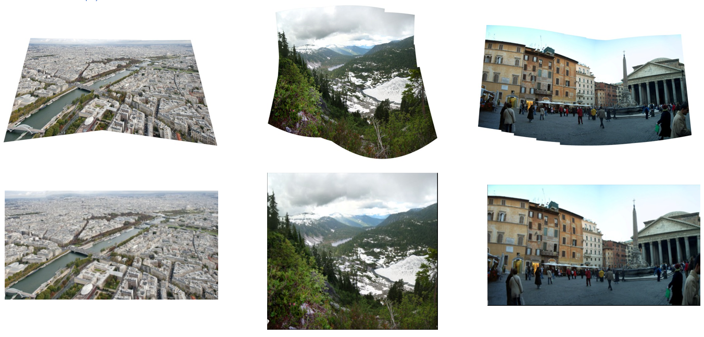
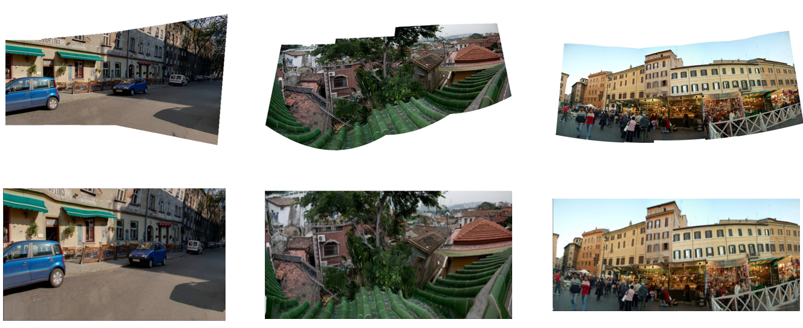

# RectanglingImages
论文《Rectangling Panoramic Images via Warping》的复现, 开发环境使用VS2019, VS版本向下兼容, 更高版本的可直接打开sln项目文件即可导入项目。

复现的源码注释较全, 如果有帮助的右上角点个小小的 :star: 叭。

论文地址：https://citeseerx.ist.psu.edu/document?repid=rep1&type=pdf&doi=aaf5392b64d7be2d0147d3f6325ce4a75dd43fd6

## 1.Background

- 大多数情况下，全景图在最原始的情况下是不规则的，可能是因为用相机拍照的时候手抖了，或者是用算法拼接的时候，结果本来就很难直接拼成矩形，所以全景图大部分都是非规则的。
- 在**Instagram**或者**Flickr**上的受欢迎的全景图中，大部分都是矩形化的，可以发现矩形化的全景图更受欢迎。
- 综上所述，将非规则的图片矩形规则化是一个很重要的课题。

## 2.Conventional Method

- **Crop**:  最直接的办法就是直接从非规则的原图中尽可能的裁剪出最大的矩形，这种方法虽然简单，但是缺点也很明显：会遗失大量的信息。
- **Inpainting**: 这是在**Crop**之后出现的算法，通过图像修复预测空白区域的图像本来应该是什么，在某些程度上能有很好的效果，但是有时候会出现**Artifact**的地方：如下图中右下角的半身所示：

- **Warping**: 本文所提出的这个方法，用变形的办法将非规则原图“拉”成矩形，这种办法的优点，其一，与其它办法相比来说，轻微的变形对于人眼来说不太明显，与对比度的显眼特征不同，其二，全景图本身就是有变形的效果，那么同用变形的办法在一定程度上会有好处，但是这种方法也会有难点，于是本文也提出了优化的地方。

### 2.1 Challenge

1.输入图片的边界不规则，那怎么把不同的规则规整为适合长宽比尺寸的矩形就是第一个难题。

2.即使图片变成矩形了，如何保证其中的内容也能保持一定的形状。

## 3.Algorithm

### 3.1LocalWarp

该算法主要采用了[Avidan and Shamir 2007]论文中的Seam Carving (以下称为**SC**) 算法，主要算法如下所示：

首先根据图像的形状，画出要生成的图片的框(最高的像素的那一行就是图像的上边框，其它边框也是一样)，然后在所有的边上找到最长的一条空白边长，然后根据这个边长从原图中截取出子图，然后从子图中执行**SC**算法，即，根据能量图选择一条最小的能量线，Seam，然后朝着最长边长的那边将所有像素复制并移动一格，然后继续找最长边，就这样不停的迭代直到所有的像素都被填满了，就可以得到矩阵化的图片。

Seam Carving算法使用扩充“能量”最小的seam来实现图像放大，定义的能量为图像的梯度值。

用像素在水平和竖直方向上的一阶梯度值之和来表示该像素点的能量，那么一条缝隙的能量就是该缝隙上所有像素点能量之和。我们需要每次找到像素能量最小的一条缝隙，然后扩充。

```c++
算法步骤：
1.计算每个像素的能量
2.找到竖直/水平方向上能量最小的路径，称为seam
3.移除seam，得到新的图像
4.重复步骤1-3 K次，得到缩放后的图像
```

**动态规划查找最优seam**

以竖直seam为例，将该问题看作最短路径问题，把每个像素看作一个节点，像素(i,j)连通的边只有上一行的左中右和下一行的左中右像素，我们要找到从第一行出发到最后一行的最短路径。

可以用经典的最短路算法来求解，然而这里可以用动态规划进行更高效的求解：设图像宽、高分别为 `W`，`H`，记 `M[i][j]` 为到 `(i, j)` 像素点的最优 seam 的像素能量和，那么我们只要找到最后一行里能量最小的像素，即 `min(M[H-1][j])`，然后回溯即可以找到最优 seam。

记像素点 `(i, j)` 的能量为 `e[i][j]`，则能量转移公式为：

`M[i][j] = e[i][j] + min(M[i-1][j-1], M[i-1][j], M[i-1][j+1])  `

可以看到，形状产生大量畸变，且有相当多的锯齿，效果很不好，但这不是最后的结果。本文首先根据该图和原图，生成每个像素的移动矩阵，然后在该图上防止一个标准的**Grid**网格，这个时候，将**Grid**根据移动矩阵**Warp**回去，网格的顶点也是要移动回去，就能得到一个在原图上的**Grid**网格，这个网格就是第一步所需要的结果。

### 3.2GlobalWarp

由于这个网格一定程度上能将图像矩形化，所以这个网格有很大的作用，那么在这个网格的基础上，优化原图像，就是第二个算法的主要途径、
第二个方法主要是通过赋予图像（其实是网格）一个能量值，通过最小化这个能量值，就能驱使原图像渐渐生成优化后的矩形图。

**能量函数的设计方法** :

- **Boundary Constraints：** 由于这个算法主要的还是矩形化图像，所以最重要的底线就是保持边界一定是矩形的，所以首先给予网格如下限制：出于左侧的所有网格顶点的纵坐标必须保持一致，上面的所有网格顶点的横坐标也必须保持一致，其他边也是。具体的方程如下所示：

- **Shape Preservation** 这个能量值的定义是从[Zhang et al. 2009]这篇论文里面得来的，其目的就是保持所有矩形块在优化前后不要有太大的变化，但是不同的是原算法中还要关注变形图的显著性物体的形状，所以会给予这些块一定的权重，但是对于全景图来说，没有所谓的显著性物体，所以没有特意设置权重。

  其中 $N$ 是块的数量， $q$ 是块的系数， $I$ 是单位矩阵， $A_q$ 和 $V_q$ 如下所示：

- **Line Preservation：**主要是从[Chang and Chuang 2012]论文中得来的算法，主要的目的就是让平行的线保持平行，让直线继续保持直直的（与原算法不一样的是不用保持倾斜角度不变）。实现的途径，首先用**LSD**(**LineSegmentDetection**)算法检测出图片中的所有线，再用网格分割所有的线到各自的格子里面，再根据每个线的倾斜角度，将线分到预先设置的盒子里面(将180度均分50份)。通过在优化过程中，约束每个格子里的所有线保持一致的倾斜角度，就能一定程度上保证图像的线不变形了。

### 3.3Optimization

优化过程如下，第一、二个矩阵不用实时更新，都可以直接计算，但是第三个不同。

所以本文首先固定每个线的倾斜角度，计算优化之后的网格是怎样的，再根据优化之后的网格计算每个线的新的倾斜角度。然后再更新那50个装线的盒子中，每个盒子的平均倾斜角度(每个线的倾斜角度和其顶点满足一定的双线性插值关系)，再计算新的倾斜条件下，优化后的网格状况。不断迭代，就能得到更好的结果了。

## 4.Implementation Result





